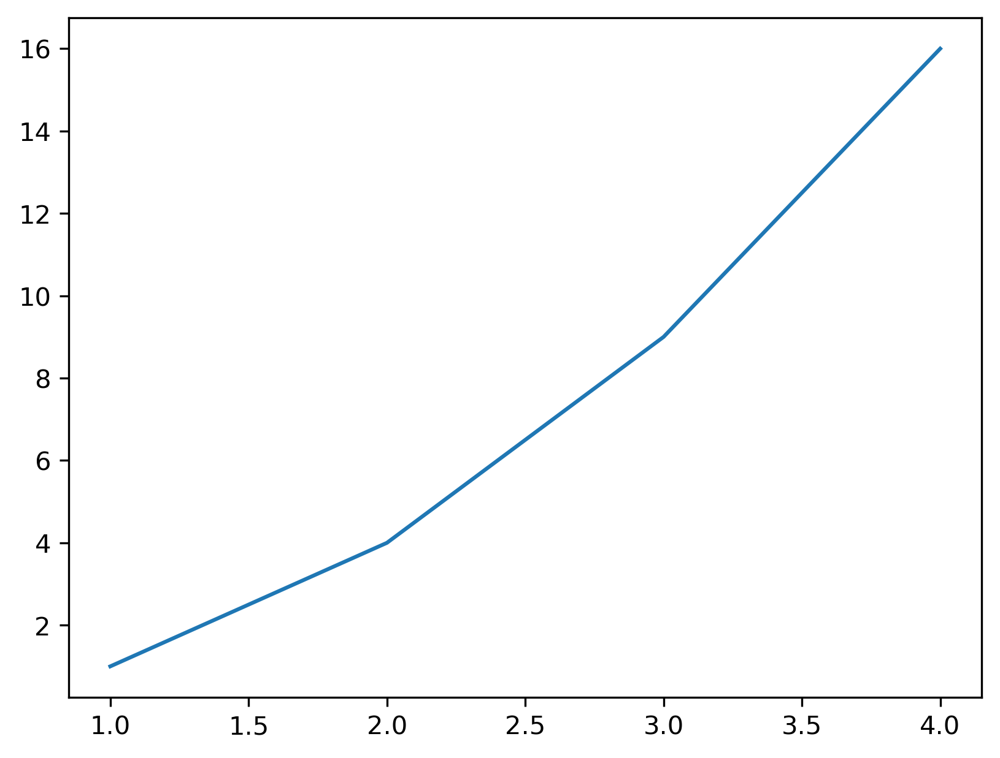
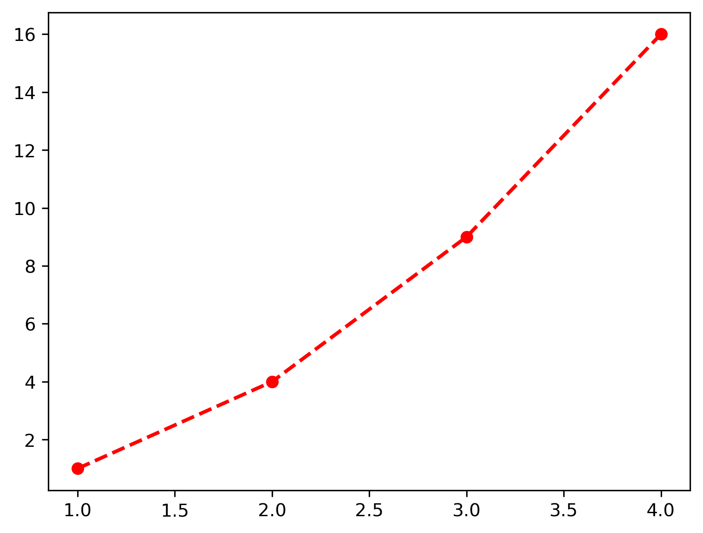
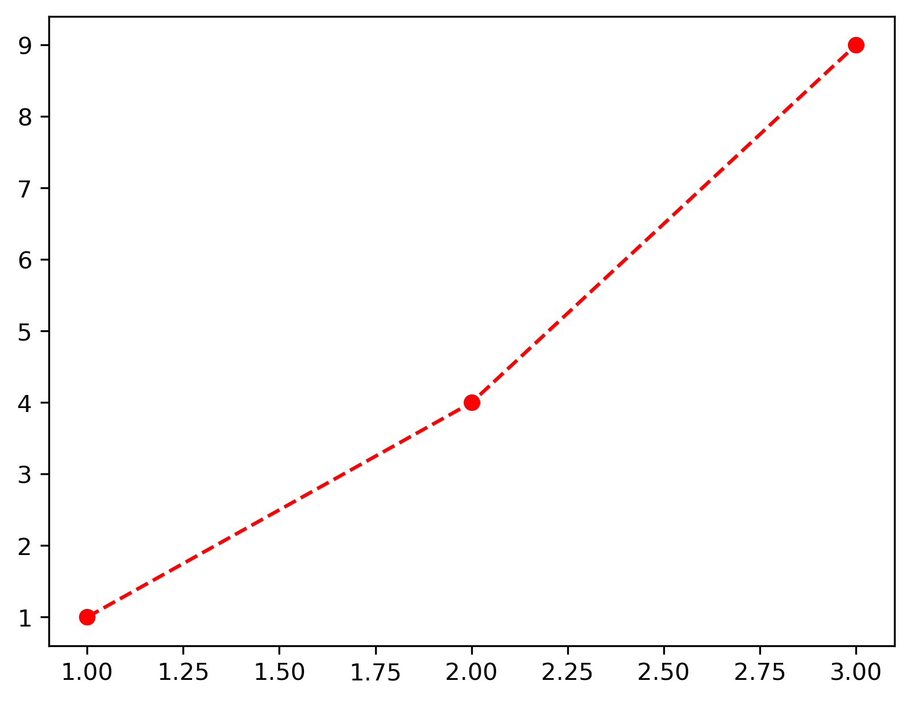
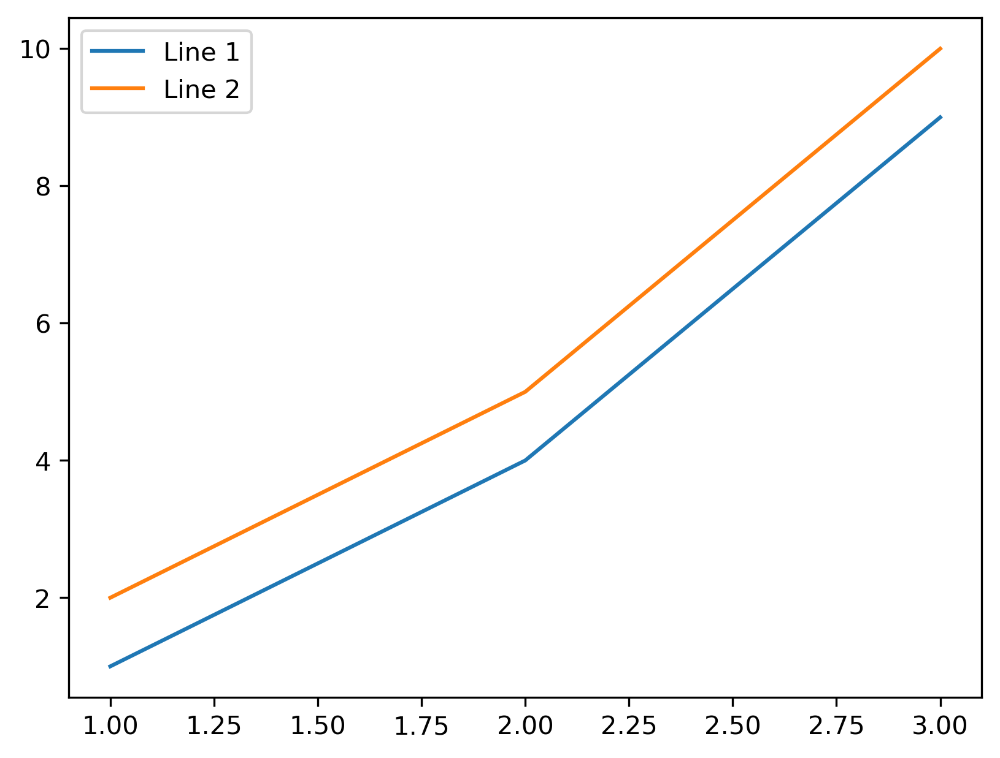
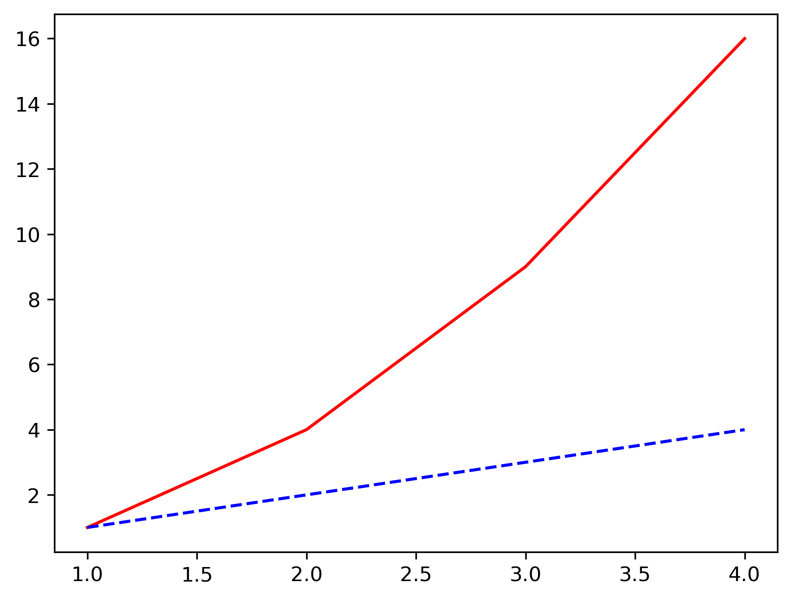
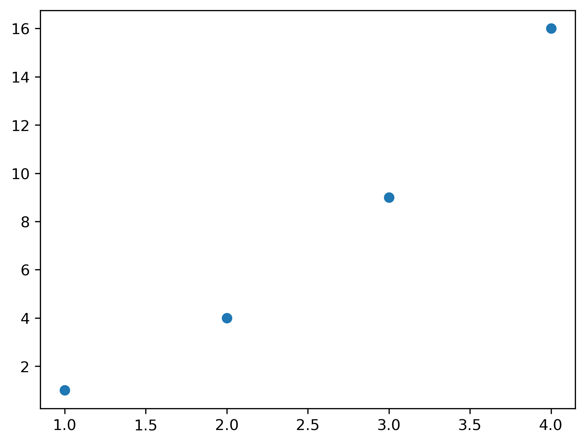
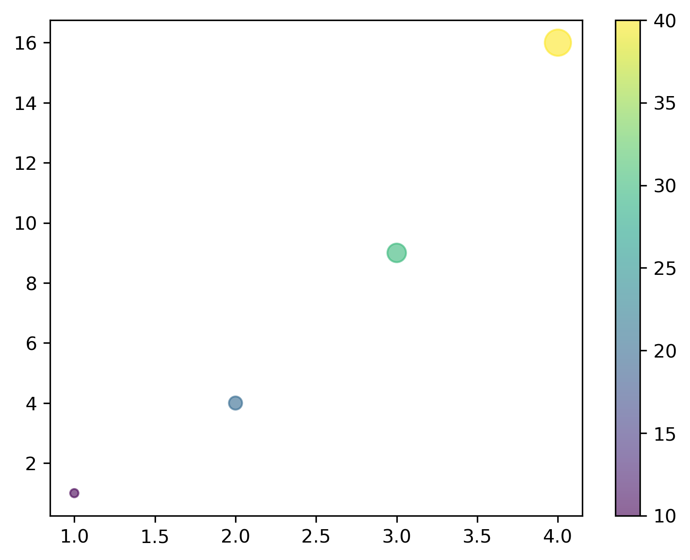
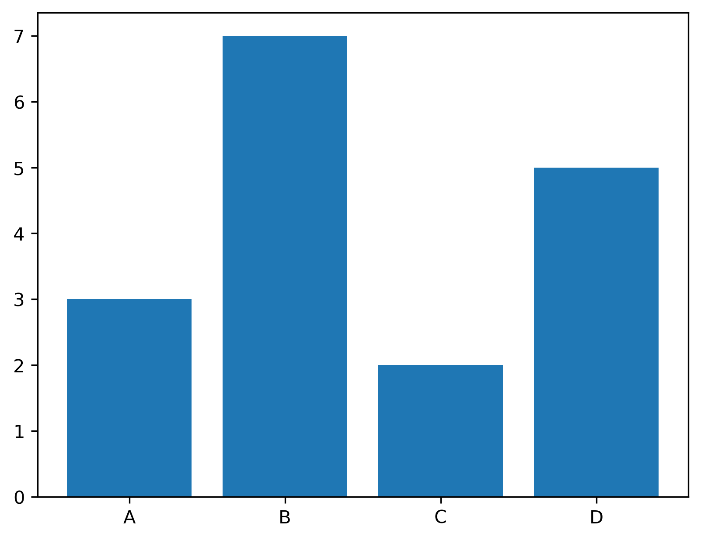
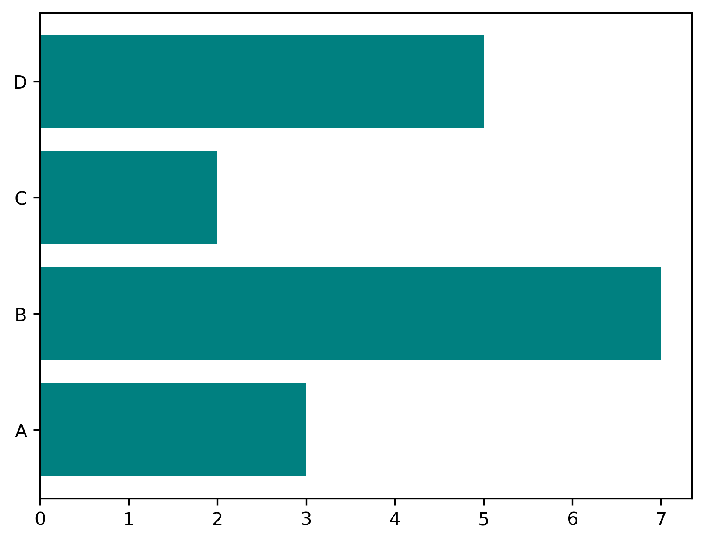
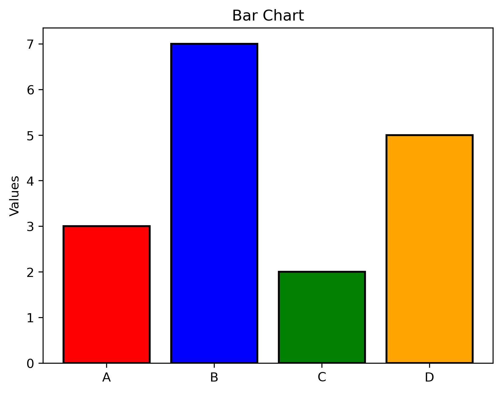

# Matplotlib – Quick Memory (Command + Output)

Note: Some outputs may vary (rendered plots, platform-dependent styles).

Matplotlib is a plotting library for creating static, animated, and interactive visualizations. Use it for quick charts, publication-ready figures, and full control over plot details.

Note: If you are using Jupyter/Colab, add `%matplotlib inline` once to render plots inside the notebook.
In regular Python scripts (outside notebooks), use `plt.show()` to display the figure window; otherwise the plot may not appear.

## Basic Line Plot

Create a simple line plot and show the figure.

```python
>>> import matplotlib.pyplot as plt

>>> plt.plot([1, 2, 3, 4], [1, 4, 9, 16])
>>> plt.show()
```


```python
>>> # With labels and title
>>> plt.plot([1, 2, 3, 4], [1, 4, 9, 16])
>>> plt.xlabel('X axis')
>>> plt.ylabel('Y axis')
>>> plt.title('Simple Line Plot')
>>> plt.show()
```


---

## Customizing Line Plots

Style lines with colors, markers, and line types.

```python
>>> plt.plot([1, 2, 3, 4], [1, 4, 9, 16], color='red', linewidth=2, linestyle='--', marker='o')
>>> plt.show()
```


**Common options:**
- `color`: 'r', 'g', 'b', 'cyan', 'magenta', '#FF5733'
- `linestyle`: '-', '--', '-.', ':'
- `marker`: 'o', 's', '^', 'D', '*', '+'
- `linewidth`: 1, 2, 3...
- `markersize`: 5, 10, 15...
- `alpha`: 0.0 to 1.0 (transparency)

```python
>>> # Shorthand notation
>>> plt.plot([1, 2, 3], [1, 4, 9], 'ro--')  # red, circles, dashed
>>> plt.show()
```


---

## Multiple Lines

Plot multiple series and add legends.

```python
>>> plt.plot([1, 2, 3], [1, 4, 9], label='Line 1')
>>> plt.plot([1, 2, 3], [2, 5, 10], label='Line 2')
>>> plt.legend()
>>> plt.show()
```


```python
>>> # Multiple lines at once
>>> x = [1, 2, 3, 4]
>>> y1 = [1, 4, 9, 16]
>>> y2 = [1, 2, 3, 4]
>>> plt.plot(x, y1, 'r-', x, y2, 'b--')
>>> plt.show()
```


---

## Scatter Plot

Visualize relationships between two variables.

```python
>>> plt.scatter([1, 2, 3, 4], [1, 4, 9, 16])
>>> plt.show()
```


```python
>>> # With size and color
>>> sizes = [20, 50, 100, 200]
>>> colors = [10, 20, 30, 40]
>>> plt.scatter([1, 2, 3, 4], [1, 4, 9, 16], s=sizes, c=colors, cmap='viridis', alpha=0.6)
>>> plt.colorbar()  # Show color scale
>>> plt.show()
```


---

## Bar Chart

Compare categories with vertical or horizontal bars.

```python
>>> categories = ['A', 'B', 'C', 'D']
>>> values = [3, 7, 2, 5]
>>> plt.bar(categories, values)
>>> plt.show()
```


```python
>>> # Horizontal bar
>>> plt.barh(categories, values, color='teal')
>>> plt.show()
```


```python
>>> # With customization
>>> plt.bar(categories, values, color=['red', 'blue', 'green', 'orange'], edgecolor='black', linewidth=1.5)
>>> plt.ylabel('Values')
>>> plt.title('Bar Chart')
>>> plt.show()
```


---

## Histogram

Show distributions by binning numeric data.

```python
>>> data = [1, 2, 2, 3, 3, 3, 4, 4, 4, 4, 5, 5, 5, 5, 5]
>>> plt.hist(data, bins=5)
>>> plt.xlabel('Value')
>>> plt.ylabel('Frequency')
>>> plt.show()
```

```python
>>> # With customization
>>> plt.hist(data, bins=5, color='skyblue', edgecolor='black', alpha=0.7)
>>> plt.show()
```

---

## Pie Chart

Show parts of a whole as slices.

```python
>>> sizes = [30, 25, 20, 25]
>>> labels = ['A', 'B', 'C', 'D']
>>> plt.pie(sizes, labels=labels)
>>> plt.show()
```

```python
>>> # With customization
>>> explode = (0.1, 0, 0, 0)  # Explode first slice
>>> plt.pie(sizes, labels=labels, autopct='%1.1f%%', startangle=90, explode=explode)
>>> plt.show()
```

---

## Box Plot

Summarize distributions with quartiles and outliers.

```python
>>> data = [[1, 2, 3, 4, 5], [2, 3, 4, 5, 6], [3, 4, 5, 6, 7]]
>>> plt.boxplot(data, labels=['Group 1', 'Group 2', 'Group 3'])
>>> plt.ylabel('Values')
>>> plt.show()
```

---

## Subplots (Grid Layout)

Arrange multiple plots in a grid.

```python
>>> plt.subplot(1, 2, 1)  # 1 row, 2 cols, position 1
>>> plt.plot([1, 2, 3], [1, 4, 9])
>>> plt.title('Plot 1')

>>> plt.subplot(1, 2, 2)  # 1 row, 2 cols, position 2
>>> plt.plot([1, 2, 3], [9, 4, 1])
>>> plt.title('Plot 2')

>>> plt.tight_layout()  # Adjust spacing
>>> plt.show()
[ Plot 1 ] [ Plot 2 ]
```

```python
>>> # 2x2 grid
>>> plt.subplot(2, 2, 1)
>>> plt.plot([1, 2], [1, 2])

>>> plt.subplot(2, 2, 2)
>>> plt.scatter([1, 2], [2, 1])

>>> plt.subplot(2, 2, 3)
>>> plt.bar(['A', 'B'], [3, 4])

>>> plt.subplot(2, 2, 4)
>>> plt.hist([1, 2, 2, 3, 3, 3])

>>> plt.tight_layout()
>>> plt.show()
```

---

## Object-Oriented Approach (Recommended)

Use fig/ax for flexible, scalable plotting.

```python
>>> fig, ax = plt.subplots()
>>> ax.plot([1, 2, 3], [1, 4, 9])
>>> ax.set_title("Example")
>>> ax.set_xlabel("X")
>>> ax.set_ylabel("Y")
>>> plt.show()
Single Axes plot with title "Example"
```

```python
>>> # Multiple subplots
>>> fig, (ax1, ax2) = plt.subplots(1, 2, figsize=(10, 4))

>>> ax1.plot([1, 2, 3], [1, 4, 9])
>>> ax1.set_title('Plot 1')

>>> ax2.scatter([1, 2, 3], [9, 4, 1])
>>> ax2.set_title('Plot 2')

>>> plt.tight_layout()
>>> plt.show()
```

```python
>>> # 2x2 grid with axes
>>> fig, axes = plt.subplots(2, 2, figsize=(10, 8))

>>> axes[0, 0].plot([1, 2, 3], [1, 2, 3])
>>> axes[0, 0].set_title('Line')

>>> axes[0, 1].scatter([1, 2, 3], [3, 2, 1])
>>> axes[0, 1].set_title('Scatter')

>>> axes[1, 0].bar(['A', 'B', 'C'], [1, 2, 3])
>>> axes[1, 0].set_title('Bar')

>>> axes[1, 1].hist([1, 1, 2, 2, 2, 3, 3, 3, 3])
>>> axes[1, 1].set_title('Histogram')

>>> plt.tight_layout()
>>> plt.show()
```

---

## Figure Size and DPI

Control figure dimensions and resolution.

```python
>>> plt.figure(figsize=(10, 6))  # Width, height in inches
>>> plt.plot([1, 2, 3], [1, 4, 9])
>>> plt.show()
```

```python
>>> # With DPI (dots per inch) for higher resolution
>>> plt.figure(figsize=(8, 6), dpi=100)
>>> plt.plot([1, 2, 3], [1, 4, 9])
>>> plt.show()
```

```python
>>> # OO approach
>>> fig, ax = plt.subplots(figsize=(10, 6))
>>> ax.plot([1, 2, 3], [1, 4, 9])
>>> plt.show()
```

---

## Axis Limits and Scales

Set axis ranges and use log scales.

```python
>>> plt.plot([1, 2, 3, 4], [1, 4, 9, 16])
>>> plt.xlim(0, 5)  # Set x-axis limits
>>> plt.ylim(0, 20)  # Set y-axis limits
>>> plt.show()
```

```python
>>> # Log scale
>>> plt.plot([1, 10, 100, 1000], [1, 2, 3, 4])
>>> plt.xscale('log')
>>> plt.yscale('log')
>>> plt.show()
```

```python
>>> # OO approach
>>> fig, ax = plt.subplots()
>>> ax.plot([1, 2, 3], [1, 4, 9])
>>> ax.set_xlim(0, 4)
>>> ax.set_ylim(0, 10)
>>> plt.show()
```

---

## Grid

Add grid lines for readability.

```python
>>> plt.plot([1, 2, 3], [1, 4, 9])
>>> plt.grid(True)
>>> plt.show()
```

```python
>>> # Customized grid
>>> plt.plot([1, 2, 3], [1, 4, 9])
>>> plt.grid(True, linestyle='--', alpha=0.5, color='gray')
>>> plt.show()
```

```python
>>> # OO approach
>>> fig, ax = plt.subplots()
>>> ax.plot([1, 2, 3], [1, 4, 9])
>>> ax.grid(True, linestyle='--', alpha=0.7)
>>> plt.show()
```

---

## Text and Annotations

Add labels, text, and arrows to highlight points.

```python
>>> plt.plot([1, 2, 3], [1, 4, 9])
>>> plt.text(2, 4, 'Point (2,4)', fontsize=12)
>>> plt.show()
```

```python
>>> # Annotation with arrow
>>> plt.plot([1, 2, 3, 4], [1, 4, 9, 16])
>>> plt.annotate('Maximum', xy=(4, 16), xytext=(3, 12),
...              arrowprops=dict(facecolor='black', shrink=0.05))
>>> plt.show()
```

---

## Legends

Label multiple series and control legend placement.

```python
>>> plt.plot([1, 2, 3], [1, 4, 9], label='Series 1')
>>> plt.plot([1, 2, 3], [2, 5, 10], label='Series 2')
>>> plt.legend()
>>> plt.show()
```

```python
>>> # Custom legend position
>>> plt.plot([1, 2, 3], [1, 4, 9], label='A')
>>> plt.plot([1, 2, 3], [2, 5, 10], label='B')
>>> plt.legend(loc='upper left')  # 'upper right', 'lower left', 'center', etc.
>>> plt.show()
```

```python
>>> # Outside the plot
>>> plt.plot([1, 2, 3], [1, 4, 9], label='A')
>>> plt.plot([1, 2, 3], [2, 5, 10], label='B')
>>> plt.legend(bbox_to_anchor=(1.05, 1), loc='upper left')
>>> plt.tight_layout()
>>> plt.show()
```

---

## Styles

Apply built-in styling themes.

```python
>>> # Available styles
>>> print(plt.style.available)
['seaborn', 'ggplot', 'dark_background', 'bmh', 'fivethirtyeight', ...]
```

```python
plt.style.use('seaborn')
plt.plot([1, 2, 3], [1, 4, 9])
plt.show()
```

```python
>>> # Context manager for temporary style
with plt.style.context('ggplot'):
    plt.plot([1, 2, 3], [1, 4, 9])
    plt.show()
```

---

## Saving Figures

Export plots to files and formats.

```python
plt.plot([1, 2, 3], [1, 4, 9])
plt.savefig('my_plot.png')
plt.show()
```

```python
>>> # With options
plt.plot([1, 2, 3], [1, 4, 9])
plt.savefig('my_plot.png', dpi=300, bbox_inches='tight', transparent=True)
plt.show()
```

```python
>>> # Different formats
plt.plot([1, 2, 3], [1, 4, 9])
plt.savefig('plot.pdf')  # PDF
plt.savefig('plot.svg')  # SVG
plt.savefig('plot.jpg')  # JPEG
plt.show()
```

---

## Heatmap (using imshow)

Display matrix-like data as a color image.

```python
import numpy as np

data = np.array([[1, 2, 3], [4, 5, 6], [7, 8, 9]])
plt.imshow(data, cmap='hot', interpolation='nearest')
plt.colorbar()
plt.show()
```

---

## Contour Plot

Plot level curves and filled contours.

```python
import numpy as np

x = np.linspace(-3, 3, 100)
y = np.linspace(-3, 3, 100)
X, Y = np.meshgrid(x, y)
Z = np.sin(X) * np.cos(Y)

plt.contour(X, Y, Z, levels=10, cmap='viridis')
plt.colorbar()
plt.show()
```

```python
>>> # Filled contour
plt.contourf(X, Y, Z, levels=20, cmap='viridis')
plt.colorbar()
plt.show()
```

---

## 3D Plots

Create 3D scatter and surface plots.

```python
from mpl_toolkits.mplot3d import Axes3D
import numpy as np

fig = plt.figure()
ax = fig.add_subplot(111, projection='3d')

x = [1, 2, 3, 4, 5]
y = [2, 3, 4, 5, 6]
z = [1, 4, 9, 16, 25]

ax.scatter(x, y, z)
ax.set_xlabel('X')
ax.set_ylabel('Y')
ax.set_zlabel('Z')
plt.show()
```

```python
>>> # 3D surface
from mpl_toolkits.mplot3d import Axes3D
import numpy as np

fig = plt.figure()
ax = fig.add_subplot(111, projection='3d')

x = np.linspace(-5, 5, 50)
y = np.linspace(-5, 5, 50)
X, Y = np.meshgrid(x, y)
Z = np.sin(np.sqrt(X**2 + Y**2))

ax.plot_surface(X, Y, Z, cmap='viridis')
plt.show()
```

---

## Subplots with Different Sizes

Build custom layouts with uneven plot sizes.

```python
fig = plt.figure(figsize=(10, 6))

ax1 = plt.subplot2grid((3, 3), (0, 0), colspan=3)  # Top row, full width
ax2 = plt.subplot2grid((3, 3), (1, 0), colspan=2)  # Middle, 2/3 width
ax3 = plt.subplot2grid((3, 3), (1, 2), rowspan=2)  # Right, 2/3 height
ax4 = plt.subplot2grid((3, 3), (2, 0))
ax5 = plt.subplot2grid((3, 3), (2, 1))

ax1.plot([1, 2, 3])
ax2.scatter([1, 2, 3], [1, 4, 9])
ax3.bar(['A', 'B'], [1, 2])
ax4.hist([1, 2, 2, 3])
ax5.pie([30, 70])

plt.tight_layout()
plt.show()
```

---

## Twin Axes (Two Y-axes)

Plot data with two different y-scales.

```python
fig, ax1 = plt.subplots()

ax1.plot([1, 2, 3], [1, 4, 9], 'b-')
ax1.set_xlabel('X')
ax1.set_ylabel('Y1', color='b')

ax2 = ax1.twinx()  # Create second y-axis
ax2.plot([1, 2, 3], [100, 200, 150], 'r-')
ax2.set_ylabel('Y2', color='r')

plt.show()
```

---

## Error Bars

Visualize variability around data points.

```python
x = [1, 2, 3, 4, 5]
y = [2, 4, 6, 8, 10]
error = [0.5, 1, 1.5, 1, 0.5]

plt.errorbar(x, y, yerr=error, fmt='o-', capsize=5)
plt.show()
```

---

## Fill Between

Shade the area between two lines.

```python
x = [1, 2, 3, 4, 5]
y1 = [1, 2, 3, 4, 5]
y2 = [2, 4, 6, 8, 10]

plt.fill_between(x, y1, y2, alpha=0.3)
plt.plot(x, y1, label='Line 1')
plt.plot(x, y2, label='Line 2')
plt.legend()
plt.show()
```

---

## Polar Plot

Plot data in polar coordinates.

```python
import numpy as np

theta = np.linspace(0, 2 * np.pi, 100)
r = np.abs(np.sin(theta) * np.cos(theta))

ax = plt.subplot(111, projection='polar')
ax.plot(theta, r)
plt.show()
```

---

## Common Colormaps

Quick reference of colormap families.

**Sequential:** `'viridis'`, `'plasma'`, `'inferno'`, `'magma'`, `'Blues'`, `'Greens'`

**Diverging:** `'coolwarm'`, `'bwr'`, `'seismic'`, `'RdBu'`

**Qualitative:** `'tab10'`, `'Set1'`, `'Paired'`

**Other:** `'hot'`, `'cool'`, `'spring'`, `'summer'`, `'autumn'`, `'winter'`, `'gray'`

---

## Key Ideas

Core takeaways to remember when working with Matplotlib.
- **Figure vs Axes:** Figure is the container, Axes is the actual plot area.
- **Object-Oriented approach is recommended** for complex plots: `fig, ax = plt.subplots()`
- **plt.show()** displays the plot (not needed in Jupyter notebooks).
- **tight_layout()** automatically adjusts spacing between subplots.
- **Always label your axes** with `xlabel()`, `ylabel()`, and add a `title()`.
- **Use legends** when plotting multiple series.
- **Save before show:** Call `savefig()` before `show()` to avoid empty images.


